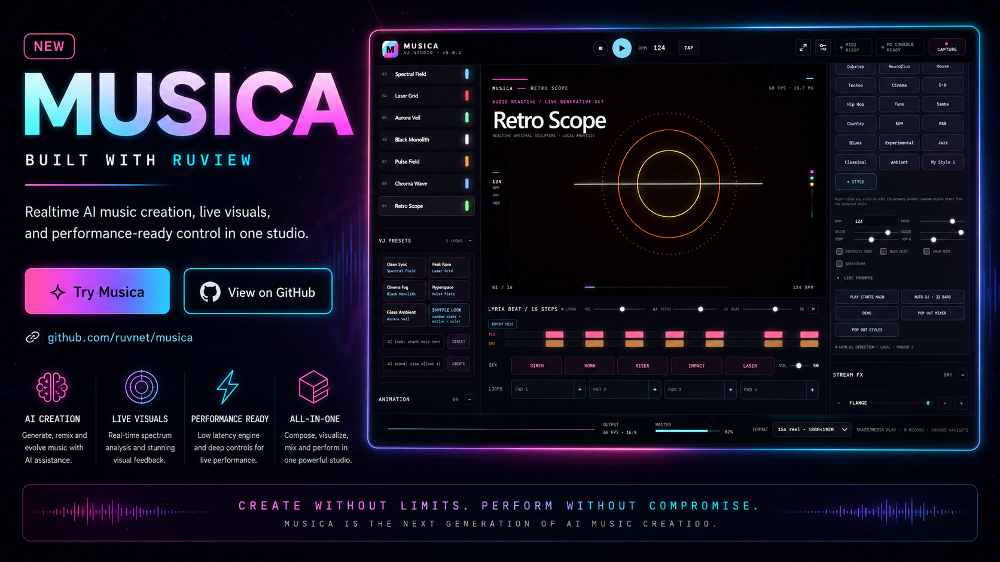

# π RuView

<p align="center">
  <strong><a href="README.md">English</a> | 日本語</strong>
</p>

<p align="center">
  <a href="https://cognitum.one/seed">
    
  </a>
</p>
<p align="center">
  <a href="https://cognitum.one/marketplace/musica">
    
  </a>
</p>

## **WiFiで壁の向こうを透視する** ##

**市販のWiFi機器を空間知能・センシングシステムへと変換します。** カメラやウェアラブル端末を一切使わず、純粋な物理現象を利用して、壁越しや暗闇の中でも人物検知、呼吸・心拍計測、動線追跡、室内モニタリングを実現します。

主要な4大スマートホームエコシステムとネイティブに連携します：HA-DISCO MQTTパブリッシャー経由の **[Home Assistant](docs/integrations/home-assistant.md)**、検出可能なHAP-1.1ブリッジとしての **[Apple Home & HomePod](docs/user-guide-apple-homepod.md)**、同じHAブリッジまたは [Matter](docs/adr/ADR-122-bfld-ruview-ha-matter-exposure.md) エンドポイント経由の **[Google Home](docs/integrations/home-assistant.md)** + **[Amazon Alexa](docs/integrations/home-assistant.md)**。Siri、Google アシスタント、Alexaはカスタムスキルなしで部屋ごとの在室状態やバイタルサインを音声で応答できます。

[](docs/integrations/home-assistant.md) [](docs/adr/ADR-122-bfld-ruview-ha-matter-exposure.md) [](docs/user-guide-apple-homepod.md) [](docs/integrations/home-assistant.md) [](docs/integrations/home-assistant.md)

> `--mqtt` フラグ1つで既存の **Home Assistant** 環境に導入できます。あるいは Matter ブリッジとして **Apple Home / Google Home / Alexa / SmartThings** にペアリング可能です。ノードごとに21個のエンティティ（11個の生信号 + 10個の推定セマンティック状態：就寝中、救急リスク、部屋アクティブ、高齢者不活発アノマリー、会議中、浴室利用中、転倒リスク上昇、離床、動きなし、複数部屋移動）および 3つのスターターHAブループリントを提供します。詳細：[`docs/integrations/home-assistant.md`](docs/integrations/home-assistant.md) · [ADR-115](docs/adr/ADR-115-home-assistant-integration.md)。

### π RuView は電波信号を空間知能へと変換するWiFiセンシングプラットフォームです。

一般的なWiFiルーターは常に空間を電波で満たしています。人が移動したり、呼吸したり、静止しているだけで、それらの電波は計測可能なパターンで変化します。RuViewは低価格なESP32センサーからのチャネル状態情報（CSI: Channel State Information）を用いてこれらの変化を捉え、「誰がどこにいて、何をしており、正常な状態か」という実用的なデータへと変換します。

**センシング機能一覧：**
- **在室・存在検知（Presence and occupancy）** — 壁越しでの人物検知、人数カウント、出入り追跡
- **バイタル測定（心拍・呼吸）（Vital Signs）** — 睡眠中や着席中の非接触型呼吸数・心拍数計測
- **アクティビティ認識（Activity recognition）** — 時系列CSIパターンからの歩行、着席、ジェスチャー、転倒検知アラート
- **環境マッピング（Environment mapping）** — **空部屋測定（ベースライン校正）**およびRFフィンガープリンティングによる部屋特定、家具移動の検知、新物体の検出
- **睡眠の質分析（Sleep quality）** — 睡眠ステージ分類および無呼吸スクリーニングを伴う夜間モニタリング

[RuVector](https://github.com/ruvnet/ruvector/) および [Cognitum Seed](https://cognitum.one) を基盤に構築されたRuViewは、すべてエッジハードウェア上で動作します（ノード単価最低 $9 のESP32メッシュと、永続メモリ・暗号証明・AI統合を提供する Cognitum Seed の組み合わせ）。クラウドやカメラ、インターネット接続は一切不要です。

システムは30秒以内に適応するスパイキングニューラルネットワークによりローカル環境を学習し、近隣ルーターを無料の電波照射源として活用する6チャネル多周波メッシュスキャンを行います。すべての測定結果はEd25519ウィトネスチェーンにより暗号学的に証明されます。

RuViewは一般的なWiFiを非接触センサーに変えます。$9のESP32基板が室内で人から反射される電波を読み取り、Hugging Faceで配信されている事前学習済み軽量モデル [`ruvnet/wifi-densepose-pretrained`](https://huggingface.co/ruvnet/wifi-densepose-pretrained) が、誰がそこにいて、どのように呼吸し、心拍数がどう推移しているかを伝えます。モデルはわずか8 KB（4-bit量子化）に収まり、Raspberry Pi上でマイクロ秒単位で動作します。（[v2エンコーダー](https://huggingface.co/ruvnet/wifi-densepose-pretrained) は、検証済みのラベルなし評価セットで**時系列トリプレット精度82.3%** を報告しています。従来の「100%存在検知」という数値は単一クラス録音で測定されたものであり、撤回されました。）カメラ不要、ウェアラブル不要、ユーザーのスマホアプリも不要です。

### 低電力エッジアプリケーション向け設計

[エッジモジュール](#-エッジモジュールカタログ) はESP32センサー上で直接動作する軽量プログラムです。インターネット接続不要、クラウド費用ゼロ、即座の応答性を実現します。

[](https://www.rust-lang.org/)
[](https://opensource.org/licenses/MIT)
[](https://github.com/ruvnet/RuView)
[](https://hub.docker.com/r/ruvnet/wifi-densepose)
[](#バイタル測定（心拍・呼吸）検知)
[](#esp32-s3-ハードウェアパイプライン)
[](https://crates.io/crates/wifi-densepose-ruvector)
[](#-エッジモジュールカタログ)

> | 機能 | 方式 | 速度 / スケール |
> |------|-----|---------------|
> | 🫁 **呼吸数** | 移相展開、円分散、ゼロ交差BPMへのバンドパスフィルタ (0.1–0.5 Hz) ([#593](https://github.com/ruvnet/RuView/issues/593)) | 6–30 BPM、リアルタイム |
> | 💓 **心拍数** | バンドパスフィルタ (0.8–2.0 Hz)、ゼロ交差BPM | 40–120 BPM、リアルタイム |
> | 👤 **存在検知** | Hugging Face上の学習済みヘッド ([`ruvnet/wifi-densepose-pretrained`](https://huggingface.co/ruvnet/wifi-densepose-pretrained); v2エンコーダー = 82.3% 時系列トリプレット精度) + モデル不要の位相分散フォールバック（**空部屋測定（ベースライン校正）**） | < 1 ms、約30秒の環境キャリブレーション |
> | 🧬 **CSIエンベディング** | 128次元対照学習エンコーダー（Hugging Face配信、4-bit量子化版は8 KB） | M4 Pro上で **164,183 emb/s** |
> | 🦴 **17キーポイント姿勢推定** | `cog-pose-estimation` Cog v0.0.1 — GCS上の署名済み aarch64 + x86_64 バイナリ、Candle経由で `pose_v1.safetensors` をロード。RTX 5080で 2.1秒で追加学習可能 ([ADR-101](docs/adr/ADR-101-pose-estimation-cog.md), [ベンチマーク](docs/benchmarks/pose-estimation-cog.md))。**MM-FiでのSOTA:** [`ruvnet/wifi-densepose-mmfi-pose`](https://huggingface.co/ruvnet/wifi-densepose-mmfi-pose) は **82.69% torso-PCK@20** (アンサンブル時 83.59%) を達成し、MultiFormer (72.25%) や CSI2Pose (68.41%) を凌駕 ([AetherArena](https://huggingface.co/spaces/ruvnet/aether-arena)) | Pi 5上で 8.4 ms コールドスタート |
> | 🚶 **動作 / アクティビティ** | **電波変動量（動作強度）**（動作帯域パワー） + 位相加速度 | リアルタイム |
> | 🤸 **転倒検知アラート** | 位相加速度閾値 + 3フレームデバウンス + 5秒クールダウン ([#263](https://github.com/ruvnet/RuView/issues/263)) | < 200 ms |
> | 🧮 **複数人カウント** | 適応型P95正規化 + 実行時チューニング可能な重複排除ファクター (`/api/v1/config/dedup-factor`, [#491](https://github.com/ruvnet/RuView/pull/491))。Cogsとして利用可能な6つの専門学習カウンタ: `occupancy-zones`, `elevator-count`, `queue-length`, `customer-flow`, `clean-room`, `person-matching` | リアルタイム、自動キャリブレーション |
> | 🌍 **ワールドモデル予測** | OccWorld TransVQVAE — 15フレーム先占有予測、209 ms推論、RTX 5080で 3.4 GB VRAM (`occworld_retrain.py` でファインチューン可能, [ADR-147](docs/adr/ADR-147-nvidia-cosmos-world-foundation-model-integration.md)) | 15フレーム × 200×200×16 ボクセル |
> | 🧱 **壁越しセンシング** | フレネルゾーン幾何学 + マルチパスモデリング | 最大約5m（信号に依存） |
> | 🧠 **エッジインテリジェンス** | **105個のCogカタログ** ([ADR-102](docs/adr/ADR-102-edge-module-registry.md)) `app-registry.json` から動作 — ヘルスケア、セキュリティ、ビル管理、リテール、産業、研究、AI、スワーム、信号処理、ネットワーク、開発者向け。Cognitum Seedの追加で永続ベクトルストア+kNN+ウィトネスチェーン対応 | 合計部品代 $140 |
> | 🎯 **カメラフリー事前学習** | 自己教師あり対照学習エンコーダー、60Kフレーム/12.2M学習ステップ、Hugging Faceにて配信 | M4 Pro上で 84秒/エポック 再学習 |
> | 📷 **カメラ監視付きファインチューン** | MediaPipe + ESP32 CSI ペア学習、RTX 5080上のエンドツーエンド Candle パイプライン ([ADR-079](docs/adr/ADR-079-camera-supervised-pose-finetune.md)) | 400エポックで2.1秒（約5ms/エポック） |
> | 📡 **多周波メッシュスキャン** | 6チャネルにわたるチャネルホッピング、TDMスロットスケジューリング ([ADR-029](docs/adr/ADR-029-multifrequency-mesh.md)) | センシング帯域幅 3倍 |
> | 🌐 **3Dポイントクラウドフュージョン** | カメラ深度（MiDaS）+ WiFi CSI + ミリ波レーダー → 統合空間モデル | 22ms パイプライン · 19K+ ポイント/フレーム |
>
> 全105モジュールのカタログは下記 [🧩 エッジモジュールカタログ](#-エッジモジュールカタログ) を参照してください。

```bash
# オプション 1: Docker (シミュレーションデータ、ハードウェア不要)
docker pull ruvnet/wifi-densepose:latest
docker run -p 3000:3000 ruvnet/wifi-densepose:latest
# ブラウザで http://localhost:3000 を開く

# オプション 2a: ESP32-S3 ハードウェアによるライブセンシング ($9)
# ファームウェアを書き込み、WiFiプロビジョニングを行ってセンシングを開始:
python -m esptool --chip esp32s3 --port COM9 --baud 460800 \
  write_flash 0x0 bootloader.bin 0x8000 partition-table.bin \
  0xf000 ota_data_initial.bin 0x20000 esp32-csi-node.bin
python firmware/esp32-csi-node/provision.py --port COM9 \
  --ssid "YourWiFi" --password "secret" --target-ip 192.168.1.20

# オプション 2b: ESP32-C6 による WiFi 6 + 802.15.4 研究向けセンシング ($6-10, ADR-110)
# 同じ csi-node ファームウェアを C6 ターゲット用にコンパイル — C6 オーバーレイ
# (sdkconfig.defaults.esp32c6) が自動的に適用されます。
cd firmware/esp32-csi-node
idf.py set-target esp32c6 && idf.py build
idf.py -p COM6 flash
# C6 ブート追加機能 (S3比較): ADR-018 バイト 18-19 での HE-LTF サブキャリアタグ付け、
#   チャネル15での 802.15.4 メッシュ時刻同期、AP対応時の TWT 設定、
#   約 5 µA のバッテリーノード向け LP-core 動体感知起動 (オプトイン)。
# v0.6.7 追加機能: LP-core RISC-V 動体ゲートプログラムおよび TWT Responder 付き
#   Wi-Fi 6 soft-AP (CONFIG_C6_{LP_CORE,SOFTAP_HE}_ENABLE で有効化)。

# オプション 3: Cognitum Seed を含むフルシステム構成 ($140)
# ESP32がCSIをストリーム → ブリッジがSeedへ転送して永続保存 + kNN + ウィトネスチェーンを実行
node scripts/rf-scan.js --port 5006           # リアルタイムRF部屋スキャン
node scripts/snn-csi-processor.js --port 5006  # SNNリアルタイム学習
node scripts/mincut-person-counter.js --port 5006  # 高精度人物カウント

# オプション 4: Python — PyPIパッケージ (ADR-117)
pip install ruview                        # または: pip install wifi-densepose
# 両方とも同じコンパイル済み PyO3 ホイール (~250 KB, abi3-py310, Linux/macOS/Windows) を配信します。
# asyncio WebSocket + paho-mqtt クライアントを含める場合:
pip install "ruview[client]"              # または: pip install "wifi-densepose[client]"

# from ruview import BreathingExtractor, HeartRateExtractor
# from ruview.client import SensingClient, RuViewMqttClient
```

[](https://pypi.org/project/ruview/) [](https://pypi.org/project/wifi-densepose/)

> [!NOTE]
> **CSI対応ハードウェア推奨。** 存在検知、**バイタル測定（心拍・呼吸）**、壁越しセンシングなどの高度な機能には、ESP32-S3（$9）または研究用NICからのチャネル状態情報（CSI）が必要です。Dockerイメージは評価用のシミュレーションデータで動作します。一般的なWiFiノートPCはRSSIのみの簡易検知となります。

> **ハードウェア選択肢:**
>
> | 選択肢 | ハードウェア | コスト | フルCSI | 機能 |
> |--------|----------|------|----------|-------------|
> | **ESP32 + Cognitum Seed** (推奨) | ESP32-S3 + [Cognitum Seed](https://cognitum.one) | 約 $140 | 対応 | 存在・**電波変動量（動作強度）**・**バイタル測定（心拍・呼吸）**・**転倒検知アラート**、複数人カウント、17キーポイント姿勢 (署名済み Cog バイナリ)、105-Cogカタログ、永続ベクトルストア、kNN検索、ウィトネスチェーン、MCPプロキシ |
> | **ESP32 メッシュ** | ESP32-S3 × 3〜6台 + WiFiルーター | 約 $54 | 対応 | 永続メモリ機能を除く上記と同等の機能 |
> | **ESP32-C6 研究ノード** ([ADR-110](docs/adr/ADR-110-esp32-c6-firmware-extension.md), [証明](docs/WITNESS-LOG-110.md), [ファームウェア v0.7.0](https://github.com/ruvnet/RuView/releases/tag/v0.7.0-esp32)) | ESP32-C6-DevKit ($6–10) | 約 $10 | 対応 (WiFi 6対応) | S3と同じCSIパイプラインをデュアルターゲットファームウェアで駆動。ESP-NOWボード間メッシュ実測: 99.56% 一致 / 104 µs スムージングオフセット標準偏差 / 3.95倍 EMA抑制。32バイト UDP 同期パケット。HE-LTF PPDU タグ付け用電線フォーマット対応。LP-core 動体ゲートおよび Wi-Fi 6 soft-AP（オプトイン）。 |
> | **研究用 NIC** | Intel 5300 / Atheros AR9580 | 約 $50-100 | 対応 | 3x3 MIMOによるフルCSI |
> | **Qualcomm CSI ベータ** ([ADR-268](docs/adr/ADR-268-qualcomm-atheros-csi-platform.md)) | QCA9300; 実験的 QCN9074/QCN9274 | 約 $30-200 | シミュレータ対応 | Rust `QCS1` コーデック、確定再実行、UDP/API 統合 |
> | **ベンダープロバイダベータ** ([ADR-270](docs/adr/ADR-270-vendor-rf-sensing-integration-program.md)) | Origin, Plume, Mist, NETGEAR, Electric Imp, RF Solutions, Luma, Nest, Linksys | 変動 | 機能依存 | 境界付き Rust アダプターおよび確定フィクスチャ |
> | **一般的な WiFi** | Windows, macOS, Linux ノートPC | $0 | 非対応 | RSSIのみ: 簡易的な存在・動作検知 ([チュートリアル #36](https://github.com/ruvnet/RuView/issues/36)) |
>
> ハードウェアをお持ちでない場合、確定リファレンス信号でパイプラインを検証できます: `python archive/v1/data/proof/verify.py`

---

  <a href="https://ruvnet.github.io/RuView/">
    
  </a>
  <br>
  <em>WiFi CSI 信号からのリアルタイム姿勢スケルトン — カメラ・ウェアラブル一切不要</em>
  <br><br>
  <a href="https://ruvnet.github.io/RuView/"><strong>▶ ライブ観測デモ（Live Observatory Demo）</strong></a>
  &nbsp;|&nbsp;
  <a href="https://ruvnet.github.io/RuView/pose-fusion.html"><strong>▶ デュアルモード姿勢統合デモ（Dual-Modal Pose Fusion Demo）</strong></a>
  &nbsp;|&nbsp;
  <a href="https://ruvnet.github.io/RuView/pointcloud/"><strong>▶ ライブ3Dポイントクラウド（Live 3D Point Cloud）</strong></a>
  &nbsp;|&nbsp;
  <a href="https://ruvnet.github.io/RuView/three.js/"><strong>▶ three.js デモギャラリー (5種類)</strong></a>

> サーバーの起動は可視化・集約用としてオプションです — ESP32単体で存在検知、**バイタル測定（心拍・呼吸）**、**転倒検知アラート**を独立して実行可能です。
>
> **ライブ ESP32 パイプライン**: ESP32-S3 ノードを接続 → センシングサーバーを実行 → [姿勢統合デモ](https://ruvnet.github.io/RuView/pose-fusion.html) を開いてリアルタイムデュアルモード姿勢推定（Webcam + WiFi CSI）を表示。詳細は [ADR-059](docs/adr/ADR-059-live-esp32-csi-pipeline.md)。
>
> **three.js シーンギャラリー** [`/three.js/`](https://ruvnet.github.io/RuView/three.js/): 5つの ADR-097 デモ（ヘルパー、シネマティック、GLTFスキン、FBXスキン、ESP32 CSIで駆動するMediaPipe→Mixamoリターゲット）。

---

## 🤗 Hugging Face 事前学習済みモデル

事前学習済み CSI 重みは [`ruvnet/wifi-densepose-pretrained`](https://huggingface.co/ruvnet/wifi-densepose-pretrained) にて公開されています。60Kフレーム / 610K対照トリプレットで 12.2M 学習ステップを実行し、**82.3% 時系列トリプレット精度** を達成。4-bit量子化版は 8 KB に収まります。128次元エンベディングを出力する対照学習CSIエンコーダーと存在検知ヘッドが含まれます。

```bash
# モデルのダウンロード
pip install huggingface_hub
huggingface-cli download ruvnet/wifi-densepose-pretrained --local-dir models/wifi-densepose-pretrained
```

**現在のサポート状況と課題:**

| 利用形態 | フォーマット | ステータス |
|----------|-------------|--------|
| Python 学習 / 評価 / エンベディング抽出 | `model.safetensors` | ✅ 動作可能 — `safetensors.torch.load_file` でロード |
| バンドルの検証 / 再エクスポート | `model.rvf.jsonl` (JSONL形式) | ✅ 動作可能 — プレーン JSONL |
| センシングサーバー `--model <PATH>` フラグ | バイナリ RVF (`RVFS` マジック) | ⚠️ ローダーが JSONL コンテナを未対応 |

**既知のギャップ:** HFモデルは JSONL RVF フォーマットで提供されていますが、`v2/crates/wifi-densepose-sensing-server/src/rvf_container.rs` はバイナリ RVF フォーマットのみをパースします。そのため、ライブ sensing-server に `--model model.rvf.jsonl` を指定すると `invalid magic` エラーが発生します。JSONL アダプターが追加されるまでは、ライブサーバーでは `--model` フラグなし（ヒューリスティックモード）で実行してください。

**量子化の選択肢:** `model-q2.bin` (4 KB) · `model-q4.bin` ⭐推奨 (8 KB) · `model-q8.bin` (16 KB) · `model.safetensors` フル (48 KB)

独立した **17キーポイント姿勢推定モデル** は [`ruvnet/wifi-densepose-mmfi-pose`](https://huggingface.co/ruvnet/wifi-densepose-mmfi-pose) で公開されており、MM-Fi にて **82.69% torso-PCK@20** (アンサンブル時 83.59%) を達成し、SOTAの MultiFormer (72.25%) や CSI2Pose (68.41%) を上回ります。

### 結果と検証（Results & Proof）

| 項目 | 場所 | 数値 |
|------|-------|---------|
| **MM-Fi 姿勢モデル (SOTA)** | [`ruvnet/wifi-densepose-mmfi-pose`](https://huggingface.co/ruvnet/wifi-densepose-mmfi-pose) | 82.69% torso-PCK@20 (単一) · 83.59% (アンサンブル) · 75Kパラメータ超小型版 74.30% |
| **AetherArena ベンチマーク** | [`ruvnet/aether-arena`](https://huggingface.co/spaces/ruvnet/aether-arena) | 検証可能なMM-Fiリーダーボード |
| **MM-Fi 詳細研究** | [`docs/benchmarks/mmfi-wifi-sensing-study.md`](docs/benchmarks/mmfi-wifi-sensing-study.md) | 姿勢+動作; ゼロショットクロスサブジェクト ~64%, 30秒室内キャリブレーションで 72.2% |
| **効率フロンティア** | [`docs/benchmarks/wifi-pose-efficiency-frontier.md`](docs/benchmarks/wifi-pose-efficiency-frontier.md) | 20 KB int4 エッジモデルでの SOTA 達成 WiFi 姿勢推定 |
| **事前学習済みエンコーダー** | [`ruvnet/wifi-densepose-pretrained`](https://huggingface.co/ruvnet/wifi-densepose-pretrained) | 82.3% 時系列トリプレット精度、8 KB int4 |
| **再現可能検証プロトコル** | [`archive/v1/data/proof/verify.py`](archive/v1/data/proof/verify.py) + [`expected_features.sha256`](archive/v1/data/proof/expected_features.sha256) | ワンコマンド確定パイプライン検証 (SHA-256) |
| **ベンチマーク証明 ADR** | [ADR-168](docs/adr/ADR-168-benchmark-proof.md) | 数値の算出と検証方法 |
| **ウィトネス証明ログ** | [`docs/WITNESS-LOG-028.md`](docs/WITNESS-LOG-028.md) | 各主張ごとのエビデンスを含む 33行の証明マトリクス |

```bash
# 確定パイプライン検証の実行 (VERDICT: PASS と表示される必要があります):
python archive/v1/data/proof/verify.py
```

---

## 🧩 エッジモジュールカタログ

<details>
<summary><b>🧩 Cognitum アプライアンスに導入可能な 105 個のエッジモジュール</b> &mdash; <code>app-registry.json</code> v2.1.0 ライブカタログ (2026-05-13 更新)。<a href="https://seed.cognitum.one/store">seed.cognitum.one/store</a> またはローカル <code>http://&lt;appliance&gt;:9000/cogs</code> で参照可能。</summary>

各モジュールは Cognitum-V0 アプライアンス上で WiFi-DensePose スタックと並行動作する署名済みバイナリ (~400 KB) です。アプライアンスは `GET /api/v1/edge/registry` ([ADR-102](docs/adr/ADR-102-edge-module-registry.md)) 経由で取得し、Ed25519 署名 ([ADR-100](docs/adr/ADR-100-cog-packaging-specification.md)) を検証してインストールします。

### 🫀 ヘルスケア (Health) &mdash; <sub>14 モジュール</sub>

| ID | 機能概要 | サイズ | 難易度 |
|----|--------------|-----:|:----------:|
| `air-quality-index` | CO2および粒子センサーによる室内空気質の追跡 | 8 KB | 簡単 |
| `baby-cry` | 乳幼児モニタリング用の中周波エネルギー連続検知。音声のみ、カメラなし。 | 451 KB | 簡単 |
| `breathing-sync` | 2人の人物の呼吸同期を検出 | 10 KB | 難しい |
| `cardiac-arrhythmia` | 不規則な心拍および異常心律動の検出 | 8 KB | 難しい |
| `cough-detect` | 30秒クラスタ集約を伴う音響過渡+スペクトル咳検知器。呼吸器疾患の早期警戒。 | 451 KB | 簡単 |
| `dream-stage` | 睡眠ステージ（レム、ノンレム浅い/深い）の追跡 | 14 KB | 難しい |
| `fall-detect` | **転倒検知アラート**（2段階衝撃+静止検知、CSI姿勢補強付き） | 402 KB | 簡単 |
| `gait-analysis` | 歩行異常の検知と**転倒検知アラート**用リスクのスコアリング | 12 KB | 難しい |
| `health-monitor` | 非接触での**バイタル測定（心拍・呼吸）**、睡眠、**転倒検知アラート** | 30 KB | 中程度 |
| `respiratory-distress` | 呼吸が苦しそうな状態や危険な頻呼吸を検出 | 10 KB | 難しい |
| `seizure-detect` | 癲癇発作を認識し即座にアラート送信 | 10 KB | 難しい |
| `sleep-apnea` | 睡眠中に呼吸が停止した状態を検出 | 4 KB | 簡単 |
| `snore-monitor` | 睡眠の質/無呼吸リスク傾向を捉える周期的な低周波エネルギー追跡。 | 451 KB | 簡単 |
| `vital-trend` | **バイタル測定（心拍・呼吸）**の数週間にわたる傾向追跡 | 6 KB | 中程度 |

### 🔒 セキュリティ (Security) &mdash; <sub>14 モジュール</sub>

| ID | 機能概要 | サイズ | 難易度 |
|----|--------------|-----:|:----------:|
| `audit-logger` | コンプライアンスのための全操作改ざん防止ログ記録 | 8 KB | 簡単 |
| `behavioral-profiler` | 正常な行動を学習し、異常行動をフラグ立て | 12 KB | 難しい |
| `fleet-auth` | 全Seed間でのデバイス証明書およびアクセス管理 | 12 KB | 中程度 |
| `glass-break` | 2段階衝撃+破砕の音響ガラス割れ検知器。通常の衝撃音と判別。 | 451 KB | 簡単 |
| `gunshot-detect` | 飽和ピーク+指数減衰の音響銃声検知器。CSI動作低下補強付き。 | 451 KB | 簡単 |
| `intrusion` | 権限のない人物の部屋への侵入を検出 | 6 KB | 中程度 |
| `intrusion-detect-ml` | 機械学習を用いたネットワーク攻撃検知 | 14 KB | 難しい |
| `loitering` | 一定場所に長領域留まっている状態を検知 | 3 KB | 簡単 |
| `network-firewall` | Cogごとの未認証ネットワークアクセスブロック | 6 KB | 簡単 |
| `panic-motion` | 突発的なパニック動作や狂乱動作を検出 | 6 KB | 中程度 |
| `perimeter-breach` | 複数ゾーンの監視と侵入方向の表示 | 10 KB | 中程度 |
| `prompt-shield` | Seedへの信号再実行およびインジェクション攻撃をブロック | 10 KB | 中程度 |
| `tailgating` | 認証者の後ろに連れ立って侵入する行為（共連れ）の検出 | 6 KB | 中程度 |
| `weapon-detect` | 人物に隠された金属物体の検出 | 8 KB | 難しい |

### 🏢 ビル管理 (Building) &mdash; <sub>11 モジュール</sub>

| ID | 機能概要 | サイズ | 難易度 |
|----|--------------|-----:|:----------:|
| `beehive-monitor` | 養蜂用音響巣箱状態分類器。健康/混乱/女王不在/分蜂などを判別。 | 451 KB | 簡単 |
| `elevator-count` | エレベーター内の人数カウント | 8 KB | 中程度 |
| `energy-audit` | スケジュールを学習し、不要なエネルギー消費を削減 | 6 KB | 中程度 |
| `frost-warning` | 温度傾向+露点差から6時間先の霜を予測（農業用）。 | 451 KB | 簡単 |
| `hvac-presence` | 人物の到着に合わせて空調を制御 | 3 KB | 簡単 |
| `lighting-zones` | 部屋間の移動に合わせて照明を自動点灯・消灯 | 4 KB | 簡単 |
| `meeting-room` | 会議室の使用・空き状態を表示 | 5 KB | 簡単 |
| `occupancy-zones` | 壁越しに各部屋の人数をカウント | 8 KB | 中程度 |
| `predictive-maintenance` | 回転機器の振動高調波アナライザー。劣化度をスコアリング。 | 451 KB | 簡単 |
| `smoke-fire` | 音響パチパチ音、熱ドリフト、CSI煙署名をフュージョンした煙・火災検出。 | 451 KB | 簡単 |
| `water-leak` | 連続する微小音+周期的な水滴音を捉える水漏れ検知器。 | 451 KB | 簡単 |

### 🛍️ リテール (Retail) &mdash; <sub>7 モジュール</sub>

| ID | 機能概要 | サイズ | 難易度 |
|----|--------------|-----:|:----------:|
| `customer-flow` | 出入口ごとの来店・退店者数カウント | 8 KB | 中程度 |
| `dwell-heatmap` | 顧客が最も時間を費やした場所のヒートマップ作成 | 6 KB | 中程度 |
| `package-detect` | ポーチや搬入場所への荷物到着・搬出をCSI変化で検出。 | 451 KB | 簡単 |
| `parking-occupancy` | ESP32 CSI サブキャリア変化による駐車場使用状況の追跡。 | 451 KB | 簡単 |
| `queue-length` | 行列の長さと待ち時間の推定 | 6 KB | 中程度 |
| `shelf-engagement` | 顧客が商品と接触・手にとった動作の検出 | 6 KB | 中程度 |
| `table-turnover` | 飲食店でのテーブル空き・使用中状態の追跡 | 4 KB | 簡単 |

### 🏭 産業 (Industrial) &mdash; <sub>7 モジュール</sub>

| ID | 機能概要 | サイズ | 難易度 |
|----|--------------|-----:|:----------:|
| `clean-room` | クリーンルームなどの管理区域での最大人数制限の徹底 | 4 KB | 簡単 |
| `confined-space` | 密閉・狭小空間での作業員の安全監視 | 5 KB | 中程度 |
| `forklift-proximity` | フォークリフトが作業員に接近した際のアラート | 10 KB | 難しい |
| `livestock-monitor` | 家畜の異常、逃亡、疾病の監視 | 6 KB | 中程度 |
| `ppe-compliance` | 制限区域への侵入時に保護具着用がない場合のアラート層。 | 387 KB | 簡単 |
| `slip-fall-zone` | **転倒検知アラート**・前駆リスク検知器。**電波変動量（動作強度）**低下+水はね音等で判定。 | 451 KB | 簡単 |
| `structural-vibration` | 建物や機械の危険な構造振動を検出 | 8 KB | 難しい |

### 🔬 研究 (Research) &mdash; <sub>12 モジュール</sub>

| ID | 機能概要 | サイズ | 難易度 |
|----|--------------|-----:|:----------:|
| `emotion-detect` | 身体言語と呼吸からストレス・リラックス状態を読み取り | 10 KB | 難しい |
| `energy-harvester` | オフグリッドSeed展開向けにソーラー・バッテリーを最適化 | 6 KB | 中程度 |
| `gesture-language` | リアルタイム手話ジェスチャー認識 | 12 KB | 難しい |
| `ghost-hunter` | 未説明の環境アノマリーの検出（ジョーク・実験用） | 10 KB | 難しい |
| `happiness-score` | 動作や気分信号から幸福度・ウェルビーイングを推定 | 8 KB | 中程度 |
| `hyperbolic-space` | ツリー構造データのための双曲空間マッピング | 12 KB | 難しい |
| `music-conductor` | 指揮者のジェスチャーからテンポとダイナミクスを読み取り | 12 KB | 難しい |
| `plant-growth` | 植物の成長速度および昼夜サイクルの追跡 | 8 KB | 中程度 |
| `rain-detect` | 降雨の開始・停止・強さの検出 | 6 KB | 中程度 |
| `ruview-densepose` | WiFiからの全身姿勢追跡 — カメラ一切不要 | 50 KB | 難しい |
| `sound-classifier` | ガラス割れ音、アラーム、赤ちゃんの泣き声等の音響分類 | 16 KB | 難しい |
| `time-crystal` | 繰り返し時間パターン対称性の実験モデル | 12 KB | 難しい |

### 🤖 AI &mdash; <sub>15 モジュール</sub>

| ID | 機能概要 | サイズ | 難易度 |
|----|--------------|-----:|:----------:|
| `anomaly-attractor` | 正常状態を学習し、あらゆる異常状態をキャッチ | 10 KB | 難しい |
| `cognitive-pipeline` | FastGRNNアノマリーゲート + SmolLM2スパースLLM推論 | 320 KB | 難しい |
| `dtw-gesture-learn` | 例を見せることでカスタム手ジェスチャーを学習 | 14 KB | 中程度 |
| `ewc-lifelong` | 過去の学習内容を忘れることなく新しい事を追加学習 (EWC) | 8 KB | 難しい |
| `federated-learning` | 生データを共有せずに複数Seed間で連合学習を実行 | 18 KB | 難しい |
| `goap-autonomy` | 自律的に目標を計画し実行 (GOAP) | 14 KB | 難しい |
| `meta-adapt` | 最高のパフォーマンスを得るために自動チューニング | 10 KB | 難しい |
| `micro-hnsw` | デバイス上での高速フィンガープリンティング・分類 | 12 KB | 中程度 |
| `neural-trader` | リアルタイムデータから市場パターンとトレンドを検知 | 20 KB | 難しい |
| `pagerank-influence` | グループ内で最も影響力のある人物を特定 | 12 KB | 中程度 |
| `pattern-sequence` | 日常のルーチンや反復される習慣を検出 | 10 KB | 中程度 |
| `rag-local` | ローカルSeed上で動作するドキュメント検索AI (RAG) | 14 KB | 中程度 |
| `spiking-tracker` | 超小型ハードウェアで動作する脳型スパイキング追跡器 | 16 KB | 難しい |
| `temporal-logic` | リアルタイムイベントストリーム上での安全ルール強制 | 12 KB | 難しい |
| `time-series-forecast` | 過去のパターンを用いてセンサーの将来トレンドを予測 | 12 KB | 中程度 |

### 🐝 スワーム (Swarm) &mdash; <sub>11 モジュール</sub>

| ID | 機能概要 | サイズ | 難易度 |
|----|--------------|-----:|:----------:|
| `swarm-backup-restore` | 他のSeedへデータを自動バックアップ — ワンクリック復元 | 8 KB | 簡単 |
| `swarm-cluster-monitor` | 全Seedの健全性とステータスを示すリアルタイムダッシュボード | 6 KB | 簡単 |
| `swarm-consensus` | 重大な変更前にSeed同士で投票を行うコンセンサス機構 | 16 KB | 難しい |
| `swarm-delta-sync` | 差分のみを送信するSeed間の自動データ同期 | 8 KB | 中程度 |
| `swarm-deploy` | 全SeedへのCogの一括インストール・削除 | 10 KB | 中程度 |
| `swarm-distributed-store` | データを複数Seedに分散保存し一括検索 | 14 KB | 難しい |
| `swarm-edge-orchestrator` | 一箇所からの全ESP32センサーノード管理 | 14 KB | 難しい |
| `swarm-load-balancer` | クエリを分散し特定Seedへの過負荷を防止 | 10 KB | 中程度 |
| `swarm-mesh-manager` | ネットワーク上の全Seedの発見・接続・監視 | 12 KB | 簡単 |
| `swarm-mqtt-bridge` | MQTTメッセージング経由でのSeed間イベント共有 | 6 KB | 簡単 |
| `swarm-witness-federation` | 改ざん防止監査トレイルを複数Seed間で共有 | 12 KB | 難しい |

### 📡 信号処理 (Signal) &mdash; <sub>6 モジュール</sub>

| ID | 機能概要 | サイズ | 難易度 |
|----|--------------|-----:|:----------:|
| `coherence-gate` | ノイズの多い信号を除外し、クリーンな信号を保持 | 8 KB | 中程度 |
| `flash-attention` | 精度向上のために特定領域にセンシングを集中 | 12 KB | 中程度 |
| `optimal-transport` | 形状認識型の信号比較を用いた動作計測 | 12 KB | 難しい |
| `person-matching` | 同一室内にいる複数人を区別して追跡 | 18 KB | 難しい |
| `sparse-recovery` | 部分的な読み取りデータから不足信号を復元 | 16 KB | 難しい |
| `temporal-compress` | 意味を失うことなく過去データを圧縮してメモリ節約 | 14 KB | 中程度 |

### 🌐 ネットワーク (Network) &mdash; <sub>1 モジュール</sub>

| ID | 機能概要 | サイズ | 難易度 |
|----|--------------|-----:|:----------:|
| `tailscale` | Tailscale WireGuard メッシュ経由でどこからでもSeedにアクセス | 700 KB | 中程度 |

### 🛠️ 開発者向け (Developer) &mdash; <sub>7 モジュール</sub>

| ID | 機能概要 | サイズ | 難易度 |
|----|--------------|-----:|:----------:|
| `adversarial` | 改ざんされた信号やスプーフィンク信号の検出 | 4 KB | 簡単 |
| `coherence` | 複数チャネルにわたる信号品質の監視 | 4 KB | 簡単 |
| `gesture` | Cogs向けコアジェスチャー認識ビルディングブロック | 6 KB | 中程度 |
| `interference-search` | 高速応答のために多数の可能性を並行検索 | 14 KB | 難しい |
| `psycho-symbolic` | ナレッジグラフ上での心理・記号推論 | 16 KB | 難しい |
| `quantum-coherence` | 高度な信号状態のための量子に着想を得たモデル | 16 KB | 難しい |
| `self-healing-mesh` | ノードが脱落してもメッシュの動作を維持 | 14 KB | 難しい |

> ℹ️ 自作Cogの作成方法: パッケージング仕様については [ADR-100](docs/adr/ADR-100-cog-packaging-specification.md) を参照してください。本リポジトリが同梱する最初のCogは [v2/crates/cog-pose-estimation/](v2/crates/cog-pose-estimation/) (17キーポイント WiFi 姿勢推定, [ADR-101](docs/adr/ADR-101-pose-estimation-cog.md)) です。

</details>

---

## 🔬 動作原理

WiFiルーターが部屋全体に照射する電波の散乱パターンを解析します：

```
WiFiルーター → 部屋に電波照射 → 人体に反射・散乱
    ↓
ESP32メッシュ (4-6ノード) が TDMプロトコルで CSI データを取得 (チャネル1/6/11)
    ↓
マルチバンドフュージョン: 3チャネル × 56サブキャリア = 168仮想サブキャリア/リンク
    ↓
マルチスタティックフュージョン: N×(N-1) リンク → アテンション重み付けクロスアングル統合
    ↓
コヒーレンスゲート: 測定データの受入/棄却判定 → チューニングなしで長期間安定動作
    ↓
信号処理: Hampel, SpotFi, Fresnel, BVP, スペクトログラム → クリーンな特徴量抽出
    ↓
AIバックボーン (RuVector): アテンション、グラフアルゴリズム、圧縮、フィールドモデル
    ↓
信号線プロトコル (CRV): 6段階ゲシュタルト → 感覚 → トポロジー → コヒーレンス → 検索 → モデル
    ↓
ニューラルネットワーク: 処理済み信号 → 17箇所の身体キーポイント + バイタルサイン + 室内モデル
    ↓
出力: リアルタイム姿勢、呼吸数、心拍数、室内フィンガープリント、異常アラート
```

カメラによる事前学習データは不要です — [自己学習システム (ADR-024)](docs/adr/ADR-024-contrastive-csi-embedding-model.md) が生のWiFiデータのみからブートストラップします。[MERIDIAN (ADR-027)](docs/adr/ADR-027-cross-environment-domain-generalization.md) により、モデルは学習した部屋だけでなく任意の部屋で動作します。

---

## 🏢 ユースケース & 応用分野

WiFiセンシングはWiFiが存在するあらゆる場所で機能します。多くの場合追加ハードウェアは不要で、既存アクセスポイントのソフトウェアまたは $8のESP32追加で実現します。カメラを使用しないため、設計段階から各種プライバシー規制（GDPR動画、HIPAA画像）をクリアしています。

**スケール:** 各APは3〜5人を識別（56サブキャリア）。複数APで線形に拡大 — 4台のAPによる店舗メッシュで約15〜20人をカバー。

| | WiFiセンシングの優位性 | 従来の代替手段 |
|---|----------------------|----------------------|
| 🔒 | **映像なし、GDPR/HIPAA規制をクリア** | カメラは同意取得、警告表示、データ保管規定が必要 |
| 🧱 | **壁、棚、障害物越しに動作** | カメラは部屋ごとの視線（Line-of-Sight）が必要 |
| 🌙 | **完全な暗闇で動作** | カメラは赤外線や照明が必要 |
| 💰 | **1エリアあたり $0〜$8**（既存WiFiまたはESP32） | カメラシステム: 1エリアあたり $200〜$2,000 |
| 🔌 | **既存のWiFi網を活用** | PIR/レーザーセンサーは新規配線工事が必要 |

<details>
<summary><strong>🏥 日常用途</strong> — ヘルスケア、リテール、オフィス、ホスピタリティ (市販WiFi)</summary>

| ユースケース | 機能概要 | ハードウェア | 主要指標 | エッジモジュール |
|----------|-------------|----------|------------|-------------|
| **高齢者介護 / 見守り** | **転倒検知アラート**、夜間行動モニタリング、睡眠中**バイタル測定（心拍・呼吸）** — ウェアラブル装着不要 | 部屋ごとに ESP32-S3 1台 ($8) | 転倒アラート <2秒 | [Sleep Apnea](docs/edge-modules/medical.md), [Gait Analysis](docs/edge-modules/medical.md) |
| **病院患者モニタリング** | 有線センサーなしで病室の**バイタル測定（心拍・呼吸）**を継続計測。アノマリー検知で看護師へ通知 | 病棟ごとに AP 1-2台 | 呼吸数: 6-30 BPM | [Respiratory Distress](docs/edge-modules/medical.md), [Cardiac Arrhythmia](docs/edge-modules/medical.md) |
| **救急外来トリアージ** | 自動在室人数カウント+待ち時間推定。待合室での患者体調急変検知 | 既存の病院WiFi | 人数精度 >95% | [Queue Length](docs/edge-modules/retail.md), [Panic Motion](docs/edge-modules/security.md) |
| **店舗人流・滞留分析** | リアルタイム歩行者数、ゾーン別滞留時間、行列長 — カメラ不要、GDPR対応 | 既存店舗WiFi + ESP32 1台 | 滞留分解能 ~1m | [Customer Flow](docs/edge-modules/retail.md), [Dwell Heatmap](docs/edge-modules/retail.md) |
| **オフィス空間利用率** | デスク/会議室の実際の利用状況、予約キャンセル自動検知、空調最適化 | 既存エンタープライズWiFi | 存在応答 <1秒 | [Meeting Room](docs/edge-modules/building.md), [HVAC Presence](docs/edge-modules/building.md) |
| **ホテル・ホスピタリティ** | ドアセンサーなしでの客室在室判定、空室時の省エネ制御 | 既存ホテルWiFi | HVACエネルギー15-30%削減 | [Energy Audit](docs/edge-modules/building.md), [Lighting Zones](docs/edge-modules/building.md) |
| **飲食店・フードサービス** | テーブル回転率の追跡、厨房スタッフの存在、トイレ使用状況表示 | 既存WiFi | 待ち時間精度 ±30秒 | [Table Turnover](docs/edge-modules/retail.md), [Queue Length](docs/edge-modules/retail.md) |
| **駐車場・立体駐車場** | カメラの死角となる階段やエレベーターでの歩行者検知・防犯アラート | 既存WiFi | コンクリート壁透過 | [Loitering](docs/edge-modules/security.md), [Elevator Count](docs/edge-modules/building.md) |

</details>

<details>
<summary><strong>🏟️ 専門用途</strong> — イベント、フィットネス、教育、公共施設 (CSI対応ハードウェア)</summary>

| ユースケース | 機能概要 | ハードウェア | 主要指標 | エッジモジュール |
|----------|-------------|----------|------------|-------------|
| **スマートホーム自動化** | 壁越しに動作する部屋ごとの在室トリガー（照明、空調、音楽） | ESP32-S3 2-3台 ($24) | 壁越し範囲 ~5m | [HVAC Presence](docs/edge-modules/building.md), [Lighting Zones](docs/edge-modules/building.md) |
| **フィットネス & スポーツ** | 運動中の回数カウント、姿勢補正、呼吸リズム計測 — 着替え場所でもカメラ不要 | ESP32-S3 メッシュ 3台以上 | 姿勢: 17キーポイント | [Breathing Sync](docs/edge-modules/exotic.md), [Gait Analysis](docs/edge-modules/medical.md) |
| **保育園 & 学校見守り** | 昼寝時の呼吸モニタリング、校庭の人数確認、危険エリア侵入アラート | ゾーンごとに ESP32-S3 2-4台 | 呼吸数: ±1 BPM | [Sleep Apnea](docs/edge-modules/medical.md), [Perimeter Breach](docs/edge-modules/security.md) |
| **大型イベント & コンサート** | 混雑度マッピング、呼吸圧迫による将棋倒しリスク検知、避難流動追跡 | マルチAPメッシュ (4-8 AP) | m²あたりの密度 | [Customer Flow](docs/edge-modules/retail.md), [Panic Motion](docs/edge-modules/security.md) |
| **スタジアム & アリーナ** | ダイナミックプライシング向けの区画別人数カウント、非常口流動モデル | エンタープライズAPグリッド | APメッシュあたり15-20人 | [Dwell Heatmap](docs/edge-modules/retail.md), [Queue Length](docs/edge-modules/retail.md) |
| **宗教施設・教会** | 顔認識なしの参列者カウント — プライバシー配慮型のキャンパス追跡 | 既存WiFi | ゾーン精度 | [Elevator Count](docs/edge-modules/building.md), [Energy Audit](docs/edge-modules/building.md) |
| **倉庫 & 物流** | 作業員安全エリアの確保、フォークリフト接近アラート | 産業用APメッシュ | アラート応答 <500ms | [Forklift Proximity](docs/edge-modules/industrial.md), [Confined Space](docs/edge-modules/industrial.md) |
| **公共インフラ** | 公共トイレでの在室判定（カメラ不可エリア）、地下鉄ホームの混雑計測 | 自治体WiFi + ESP32 | リアルタイム人数カウント | [Customer Flow](docs/edge-modules/retail.md), [Loitering](docs/edge-modules/security.md) |
| **美術館 & ギャラリー** | 入館者動線ヒートマップ、展示品前での滞留時間計測 — フラッシュ/盗難防止 | 既存WiFi | 滞留精度 ±5秒 | [Dwell Heatmap](docs/edge-modules/retail.md), [Shelf Engagement](docs/edge-modules/retail.md) |

</details>

<details>
<summary><strong>🤖 ロボティクス & 産業分野</strong> — 自律システム、製造業、アンドロイド空間認識</summary>

WiFiセンシングは、LIDARやカメラが機能しない粉塵・煙・霧・死角などの環境下で動作する空間認識レイヤーをロボットに提供します。

| ユースケース | 機能概要 | ハードウェア | 主要指標 | エッジモジュール |
|----------|-------------|----------|------------|-------------|
| **協働ロボット安全エリア** | 協働ロボット周辺の人体接近検知 — 接触前の自動減速・停止 | セルごとに ESP32-S3 2-3台 | 存在応答 <100ms | [Forklift Proximity](docs/edge-modules/industrial.md), [Perimeter Breach](docs/edge-modules/security.md) |
| **倉庫AMR自律走行** | 死角や棚の陰にいる人物を事前に感知 — LIDARの遮蔽を克服 | 通路沿いの ESP32 メッシュ | 棚越し検知 | [Forklift Proximity](docs/edge-modules/industrial.md), [Loitering](docs/edge-modules/security.md) |
| **ヒューマノイド空間認識** | 周囲の人体姿勢センシング — ジェスチャーや接近方向をカメラ常時オンなしで認識 | 車載 ESP32-S3 モジュール | 17キーポイント姿勢 | [Gesture Language](docs/edge-modules/exotic.md), [Emotion Detection](docs/edge-modules/exotic.md) |
| **製造ラインモニタリング** | 各ステーションの作業員存在確認、人間工学的な姿勢アラート | ゾーンごとに産業用AP | 姿勢 + 呼吸 | [Confined Space](docs/edge-modules/industrial.md), [Gait Analysis](docs/edge-modules/medical.md) |
| **建設現場の安全管理** | 重機周辺の立入禁止エリア監視、足場からの**転倒検知アラート** | 堅牢化 ESP32 メッシュ | アラート <2秒、粉塵透過 | [Panic Motion](docs/edge-modules/security.md), [Structural Vibration](docs/edge-modules/industrial.md) |
| **農業ロボティクス** | 視界不良な農場環境での自律収穫機周辺の作業員検知 | 全天候型 ESP32 ノード | 開けた圃場で範囲 ~10m | [Forklift Proximity](docs/edge-modules/industrial.md), [Rain Detection](docs/edge-modules/exotic.md) |
| **ドローン着陸エリア** | 着陸地点に人間がいないかの確認 — 雨・粉塵・暗闇でも動作 | 地上 ESP32 ノード | 存在精度 >95% | [Perimeter Breach](docs/edge-modules/security.md), [Tailgating](docs/edge-modules/security.md) |
| **クリーンルーム監視** | カメラ不適切な環境での作業員追跡およびクリーンスーツ着用姿勢適合 | 既存クリーンルームWiFi | 発塵なし | [Clean Room](docs/edge-modules/industrial.md), [Livestock Monitor](docs/edge-modules/industrial.md) |

</details>

<details>
<summary><strong>🔥 極限環境</strong> — 壁透過、災害救助、防衛、地下</summary>

コンクリート、瓦礫、土砂などの固体を電波が透過する特性を活用します。WiFi-Mat 災害モジュール (ADR-001) はこの階層向けに設計されています。

| ユースケース | 機能概要 | ハードウェア | 主要指標 | エッジモジュール |
|----------|-------------|----------|------------|-------------|
| **災害探索救助 (WiFi-Mat)** | 瓦礫下の生存者の呼吸サイン検知、トリアージ色分類、3D位置特定 | ポータブル ESP32 メッシュ | 厚さ 30cm コンクリート透過 | [Respiratory Distress](docs/edge-modules/medical.md), [Seizure Detection](docs/edge-modules/medical.md) |
| **消防活動・消火作業** | 煙や壁の向こうにいる逃げ遅れ者を侵入前に発見 | 車載ポータブルメッシュ | 視界ゼロで動作 | [Sleep Apnea](docs/edge-modules/medical.md), [Panic Motion](docs/edge-modules/security.md) |
| **刑務所 & 警備施設** | 独居房の在室確認、異常**バイタル測定（心拍・呼吸）**の検知 — 死角なしの全周監視 | 専用 AP インフラ | 24/7 バイタル監視 | [Cardiac Arrhythmia](docs/edge-modules/medical.md), [Loitering](docs/edge-modules/security.md) |
| **軍事 / タクティカル** | 壁越しの要員検知、部屋クリアランス確認、遠距離での人質**バイタル測定（心拍・呼吸）**確認 | 指向性 WiFi + カスタムFW | 壁越し範囲 5m | [Perimeter Breach](docs/edge-modules/security.md), [Weapon Detection](docs/edge-modules/security.md) |
| **国境・外周警備** | トンネル内、フェンス裏、車両内の人体存在検知 — 受動センシング | 隠蔽 ESP32 メッシュ | パッシブ / 隠密動作 | [Perimeter Breach](docs/edge-modules/security.md), [Tailgating](docs/edge-modules/security.md) |
| **鉱山・地下作業** | GPS/カメラが効かない坑内での作業員位置把握・崩落後の呼吸検知 | 堅牢化 ESP32 メッシュ | 岩盤・土砂透過 | [Confined Space](docs/edge-modules/industrial.md), [Respiratory Distress](docs/edge-modules/medical.md) |
| **海洋 & 船舶** | 鋼鉄隔壁越しの船員追跡、落水者検知 | 船内 WiFi + ESP32 | 1-2枚の隔壁透過 | [Structural Vibration](docs/edge-modules/industrial.md), [Panic Motion](docs/edge-modules/security.md) |
| **野生動物研究** | 巣穴や飼育エリアでの動物の非侵襲行動モニタリング | 全天候型 ESP32 ノード | 光刺激ゼロ | [Livestock Monitor](docs/edge-modules/industrial.md), [Dream Stage](docs/edge-modules/exotic.md) |

</details>

---

<details>
<summary><strong>🧠 自己学習 WiFi AI (ADR-024)</strong> — 適応型認識、自己最適化、インテリジェントアノマリー検知</summary>

部屋を通過するすべてのWiFi信号は、その空間固有のフィンガープリントを作成します。自己学習WiFi AIは、その特徴をコンパクトで再利用可能なベクトルとして保存し、新しい環境に対して継続的に自動最適化を行います。

**主な特徴:**
- 任意のWiFi信号を、部屋の状態を表す 128次元の「フィンガープリント」へ変換
- 生のWiFiデータのみから完全自己教師ありで学習 — カメラ、ラベル、人間の監督は不要
- WiFiのみを用いて部屋の認識、侵入検知、アクティビティ分類を実行
- $8のESP32チップ上で動作（モデル全体が 55 KB のメモリに収まります）
- 単一の計算で身体姿勢追跡と環境フィンガープリントの両方を出力

**主要機能一覧**

| 機能 | 動作原理 | メリット |
|------|-------------|----------------|
| **自己教師あり学習** | ラベルなしのWiFi信号から類似性と違いを自動学習 | センサーを設置して10分待つだけでどこにでも展開可能 |
| **部屋の自動特定** | 部屋ごとの固有のWiFiフィンガープリントを認識 | GPSやビーコンなしでどの部屋にいるかを判別 |
| **アノマリー検知** | 予期せぬ人物やイベントによる未知のフィンガープリントを検出 | 侵入や**転倒検知アラート**を自動的に発報 |
| **人物再識別** *(研究段階)* | チャネル類似性マッチング（Soul Signature §3.6） | 実験的研究機能 — 決定的なAETHERチャネルを要求 |
| **環境適応** | MicroLoRA アダプター（部屋あたり1,792パラメータ）でファインチューン | 93%少ないデータで新しい部屋に適応 |
| **記憶の保持** | EWC++ 正則化により事前学習済みの知識の忘却を防止 | 新しいタスクを追加しても過去の知識を維持 |
| **ハードネガティブマイニング** | 最も紛らわしい例に焦点を当てて高速に学習 | 同じデータ量でより高い精度を達成 |

**アーキテクチャ**

```
WiFi 信号 [56チャネル] → Transformer + グラフニューラルネットワーク
                                   ├→ 128次元の環境フィンガープリント (検索・特定用)
                                   └→ 17箇所の身体キーポイント (人物追跡用)
```

**クイックスタート**

```bash
# ステップ 1: 生のWiFiデータから自己学習 (ラベル不要)
cargo run -p wifi-densepose-sensing-server -- --pretrain --dataset data/csi/ --pretrain-epochs 50

# ステップ 2: 姿勢ラベルによるファインチューン
cargo run -p wifi-densepose-sensing-server -- --train --dataset data/mmfi/ --epochs 100 --save-rvf model.rvf

# ステップ 3: ライブWiFiからのフィンガープリント抽出
cargo run -p wifi-densepose-sensing-server -- --model model.rvf --embed

# ステップ 4: 類似環境の検索・アノマリー検知
cargo run -p wifi-densepose-sensing-server -- --model model.rvf --build-index env
```

**学習モード**

| モード | 必要なもの | 得られる成果 |
|------|--------------|-------------|
| 自己教師あり (Self-Supervised) | 生のWiFiデータのみ | WiFi信号構造を理解した基礎モデル |
| 教師あり (Supervised) | WiFiデータ + 姿勢ラベル | フル姿勢追跡 + 環境フィンガープリント |
| クロスモーダル (Cross-Modal) | WiFiデータ + 映像データ | 視覚理解と整合したフィンガープリント |

**フィンガープリントインデックスの種類**

| インデックス | 保存内容 | 実環境での用途 |
|-------|---------------|----------------|
| `env_fingerprint` | 部屋の平均フィンガープリント | 「ここは台所か、寝室か？」 |
| `activity_pattern` | 動作境界 | 「調理中か、就寝中か、運動中か？」 |
| `temporal_baseline` | **空部屋測定（ベースライン校正）** | 「この部屋で何か異変が起きた」 |
| `person_track` | 個人動線サイン | 「人物Aがリビングに入った」 |

**モデルサイズ**

| コンポーネント | パラメータ数 | メモリ使用量 (ESP32上) |
|-----------|-----------|-------------------|
| Transformer バックボーン | 約 28,000 | 28 KB |
| エンベディング投影ヘッド | 約 25,000 | 25 KB |
| 部屋ごとの MicroLoRA アダプター | 約 1,800 | 2 KB |
| **合計** | **約 55,000** | **55 KB** (利用可能 520 KB 中) |

詳細は [`docs/adr/ADR-024-contrastive-csi-embedding-model.md`](docs/adr/ADR-024-contrastive-csi-embedding-model.md) を参照してください。

</details>

---

## 🧩 Claude Code & Codex プラグイン

RuViewは [Claude Code](https://docs.anthropic.com/en/docs/claude-code) プラグイン（および Codex プロンプトミラー）を同梱しており、ESP32セットアップ、アプリ実行、モデル学習、検証等を 9つのSkill、7つの `/ruview-*` コマンド、3つのAgentとして提供します。[`plugins/ruview/`](plugins/ruview/README.md) に配置されています。

```bash
# Claude Code でのインストール:
/plugin marketplace add ruvnet/RuView
/plugin install ruview@ruview

# ローカルクローンから一時セッションで試す場合:
claude --plugin-dir ./plugins/ruview

# 利用可能なコマンド:
#   /ruview-start      → オンボーディング (Docker / ビルド / 実機)
#   /ruview-flash      → ESP32 ファームウェアビルド & 書き込み
#   /ruview-provision  → WiFi / IP / メッシュ設定
#   /ruview-app        → センシングアプリ実行 (存在 / バイタル / 姿勢 / 睡眠 / MAT / ポイントクラウド)
#   /ruview-train      → モデル学習 & 評価
#   /ruview-advanced   → マルチスタティック / トモグラフィ / クロスアングル
#   /ruview-verify     → テスト & 確定証明検証
```

**ポータブルハーネス — `npx @ruvnet/ruview`:** リポジトリをクローンせずに各種操作を行えるMCPツールキット ([ADR-182](docs/adr/ADR-182-npx-ruview-harness-via-metaharness.md))。測定値と主張値の整合性をコードレベルで評価・強制します。

---

## 📖 ドキュメント一覧

| ドキュメント | 説明 |
|----------|-------------|
| [ユーザーガイド (User Guide)](docs/user-guide.md) | ステップバイステップの設置・実行・API使用法・学習ガイド |
| [ビルドガイド (Build Guide)](docs/build-guide.md) | ソースコードからのビルド手順（Rust および Python） |
| [**Home Assistant + Matter 連携**](docs/integrations/home-assistant.md) | MQTT自動検出およびMatterブリッジ連携ガイド（全エンティティカタログ、3つのブループリント、Lovelaceダッシュボード） ([ADR-115](docs/adr/ADR-115-home-assistant-integration.md)) |
| [**BFLD — ビームフォーミングフィードバック層**](v2/crates/wifi-densepose-bfld/README.md) | 802.11ac/ax ビームフォーミング情報からのプライバシー漏洩を物理的に防止する型安全センシング層 ([ADR-118](docs/adr/ADR-118-bfld-beamforming-feedback-layer-for-detection.md)) |
| [**SENSE-BRIDGE — rvagent MCP サーバー**](tools/ruview-mcp/README.md) | AIエージェントとRuViewセンシングスタックを接続するデュアルトランスポート MCP サーバー (`@ruvnet/rvagent`) ([ADR-124](docs/adr/ADR-124-rvagent-mcp-ruvector-npm-integration.md)) |
| [セマンティックプリミティブメトリクス](docs/integrations/semantic-primitives-metrics.md) | 10個のセマンティック状態ごとの F1 スコア精度メトリクス |
| [Claude Code / Codex プラグイン](plugins/ruview/README.md) | `ruview` プラグインとマーケットプレイス設定 |
| [ポータブルハーネス — `npx @ruvnet/ruview`](harness/ruview/README.md) | MCPツールおよび測定値/主張値ガードレールを提供するハーネス |
| [アーキテクチャ決定記録 (ADR)](docs/adr/README.md) | 182件の技術的意思決定記録 |
| [ドメインモデル (DDD)](docs/ddd/README.md) | 8つのDDDドメインモデル定義 |
| [rvCSI — エッジRFセンシングランタイム](https://github.com/ruvnet/rvcsi) | Rust/TS向けのハードウェア抽象化CSIランタイム（Raspberry Pi 5 / Nexmon 対応） |
| [デスクトップアプリ](v2/crates/wifi-densepose-desktop/README.md) | **WIP** — ノード管理・OTA更新・WASMデプロイ向け Tauri v2 デスクトップアプリ |
| `ruview-swarm` | ドローン自律制御スワームシステム (ADR-148) |
| [医療向け応用例](examples/medical/README.md) | 60 GHz ミリ波レーダーを用いた非接触血圧・心拍・呼吸数計測 |
| [拡張ドキュメントインデックス](docs/readme-details.md) | 各種機能、セットアップ、CLI、テストの拡張ガイド |

---

## 🚧 ベータソフトウェアについて

> **ベータソフトウェア** — 現在活発に開発が進行中です。APIやファームウェアは変更される可能性があります。既知の制限事項：
> - ESP32-C3 および初代 ESP32 は非対応です（シングルコアのためCSI DSP処理能力が不足しています）
> - 単一の ESP32 のみでの展開は空間解像度に限界があります — 最高の精度のために2台以上のノードまたは [Cognitum Seed](https://cognitum.one) の追加を推奨します
> - カメラなしでの姿勢推定精度は制限されます（プロキシラベルで PCK@20 ≈ 2.5%） — [カメラグランドトゥルース学習](docs/adr/ADR-079-camera-ground-truth-training.md) は **35%+ PCK@20** を目標として開発進行中です。
>
> バグ報告やコントリビューションは [Issues](https://github.com/ruvnet/RuView/issues) にて歓迎します。

## 📄 ライセンス

MIT License — 詳細は [LICENSE](LICENSE) を参照してください。

## 🤝 クリエイターアフィリエイトプログラム

**TikTok · Instagram · YouTube クリエイター向け** — 紹介経由の Cognitum 販売額の **25% を還元** します。既に数百万回再生されている RuFlo, RuView, RuVector 動画のトラフィックを収益化できます。

[今すぐ応募 → cognitum.one/affiliate](https://cognitum.one/affiliate)

## 📞 サポート

[GitHub Issues](https://github.com/ruvnet/RuView/issues) | [Discussions](https://github.com/ruvnet/RuView/discussions) | [PyPI](https://pypi.org/project/wifi-densepose/)

---

**WiFi DensePose** — WiFi信号によるプライバシー保護型人物姿勢推定システム。
